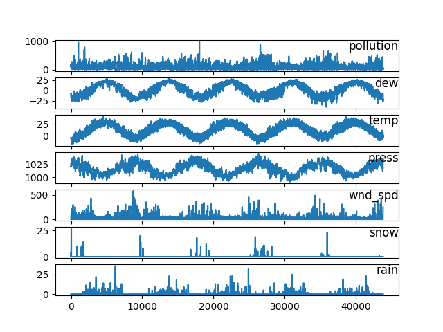
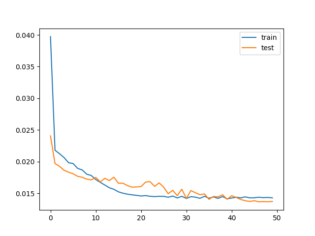

#  Long Short-Term Memory Model to forecast pollution levels

Using historical reports of weather and pollution levels in Beijing(CN) to frame a forecasting problem to forecast the pollution at the next hours based on weather conditions and pollution for previous hours.

- This analysis is being conducted under the folder **lstm-multivariate**. 
- **lstm-univariate contains** an LSTM application for an univariate problem
- **timeseries-to-supervised-problem** contains the code-base to convert a time-series to a supervised problem.

## The dataset
The dataset (raw.csv document in this folder) includes the following values:
- No: row number
- year: year of data in this row
- month: month of data in this row
- day: day of data in this row
- hour: hour of data in this row
- pm2.5: PM2.5 concentration
- DEWP: Dew Point
- TEMP: Temperature
- PRES: Pressure
- cbwd: Combined wind direction
- Iws: Cumulated wind speed
- Is: Cumulated hours of snow
- Ir: Cumulated hours of rain

## Exploratory analysis

The 5 years of data can be seen in the following graph:




## Data preparation:

The categorical variable (Wind Direction) was labeled using a LabelEncoder().
All the NaN values were filled with 0.
The first 24 hours didnt contain any data, therefore they were dropped.
All the features were scaled with MinMaxScaler(), having the feature range to be (0,1).


## Data Transofrmation:

The function series_to_supervised was used to prepare the dataset in a way that makes sense for an LSTM.
The Transformed dataset has the timesteps and features for the previous moments before the current hour, and 1 output variable.

## Testing, training, and fitting
The dataset was manually split into:
- train: Everything for the last year.
- test: Everything else, up to last year.

Then, the output (y) was defined as being the last value, and the input (X) were to be everything else.

The X and y arrays were reshaped to have the following input (crucial for LSTM):
[samples, time-steps, features]

It looks like this:
```
# Reshaping the inputs to be 3d [samples, timesteps, features]
train_X = train_X.reshape((train_X.shape[0],n_hours,n_features))
test_X = test_X.reshape((test_X.shape[0], n_hours, n_features)) 
```

At last, the fit() in-built function is used to fit the model, with defined epochs and batch-sizes.
the validation data used is the test_X and test_y arrays.

The following plot showcases the training and test loss:




## Predictions

Used the in-built predict() method from SciKitLearn to run the predictions.
The predictions are output as a 3D vector.
In order to go back to a 2D shape, the following reshape function has to be called:
```
test_X = test_X.reshape((test_X.shape[0], n_hours*n_features))
```
where text_X.shape[0] is the number of samples.


## Edits and changes
Go crazy and change this model to suit your problem!
Play around with the layer structure, and depending on the nature of your problem you can try some of the standard loss functions and optimization algorithms:

Standard loss functions for different predictive model types:
- **Regression**: Mean Squared Error or ‘mean_squared_error’.
- **Binary Classification (2 class)**: Logarithmic Loss, also called cross entropy or ‘binary_crossentropy‘.
- **Multiclass Classification (>2 class)**: Multiclass Logarithmic Loss or ‘categorical_crossentropy‘.


Optimization algorithms:
- **Stochastic Gradient Descent**: Requires the tuning of a learning rate and momentum.
- **ADAM**: Requires the tuning of learning rate.
- **RMSprop**: Requires the tuning of learning rate.


## Libraries Used

| Name | Library |
| ------ | ------ |
| Pandas | https://pandas.pydata.org/ |
| Matplotlib | https://matplotlib.org/ |
| SciKitLearn | https://scikit-learn.org/stable/ |